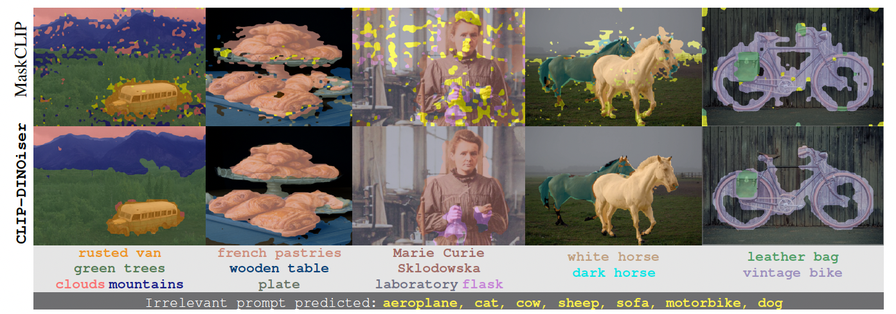
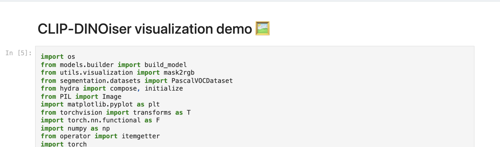

<div align="center">
<h2>
CLIP-DINOiser: Teaching CLIP a few DINO tricks for Open-Vocabulary Semantic Segmentation <br>
<p></p>

<p></p>

<a href="https://wysoczanska.github.io/">Monika Wysoczańska</a>&ensp;
<a href="https://osimeoni.github.io/">Oriane Siméoni</a>&ensp;
<a href="https://michaelramamonjisoa.github.io/">Michaël Ramamonjisoa</a>&ensp;
<a href="https://abursuc.github.io/">Andrei Bursuc</a>&ensp;
<a href="http://staff.ii.pw.edu.pl/~ttrzcins/">Tomasz Trzciński</a>&ensp;
<a href="https://ptrckprz.github.io/">Patrick Pérez</a>&ensp;


<p></p>
<a href="https://arxiv.org/abs/2312.12359"></a>
<a href="https://wysoczanska.github.io/CLIP_DINOiser/"></a>
<a href=""></a>
<p></p>




https://github.com/wysoczanska/clip_dinoiser/assets/18114410/2a80e9c1-35b2-4f13-94a7-4946a4e11120
</h2>
</div>

Official PyTorch implementation of [**CLIP-DINOiser: Teaching CLIP a few DINO tricks**]().

```
@article{wysoczanska2023clipdino,
        title={CLIP-DINOiser: Teaching CLIP a few DINO tricks for open-vocabulary semantic segmentation},
        author={Wysocza{\'n}ska, Monika and Sim{\'e}oni, Oriane and Ramamonjisoa, Micha{\"e}l and Bursuc, Andrei and Trzci{\'n}ski, Tomasz and P{\'e}rez, Patrick},
        journal={ECCV},
        year={2024}
}
```

<details>
<summary><span style="font-weight: bold;">Updates</span></summary>
<ul>
  <li><b>[27/03/2023]</b> Training code out. Updated weights to the ImageNet trained. Modified MaskCLIP code to directly load weights from OpenCLIP model.</li>
  <li><b>[20/12/2023]</b> Code release</li>
</ul>
</details><br>

## Demo
Try our model! 
### Requirements
Set up the environment:
```
# Create conda environment
conda create -n clipdino python=3.9
conda activate clipdino
conda install pytorch==1.12.1 torchvision==0.13.1 cudatoolkit=[your CUDA version] -c pytorch
pip install -r requirements.txt
```

You will also need to install MMCV and MMSegmentation by running:

```
pip install -U openmim
mim install mmengine    
mim install "mmcv-full==1.6.0"
mim install "mmsegmentation==0.27.0"
```

### Running from the notebook
You can try our model through jupyter notebook ```demo.ipynb```.



### Running from command line
You can also try our demo from the command line:

```
python demo.py --file_path [path to the image file] --prompts [list of the text prompts separated by ',']
```

Example:
```
python demo.py --file_path assets/rusted_van.png --prompts "rusted van,foggy clouds,mountains,green trees" 
```

## Reproducing results

### Dataset preparation
In the paper, following previous works, we use 8 benchmarks; (i) w/ background: PASCAL VOC20, PASCAL Context59, and COCO-Object, and (ii) w/o background: PASCAL VOC, PASCAL Context, COCO-Stuff, Cityscapes, and ADE20k.

To run the evaluation, download and set up PASCAL VOC, PASCAL Context, COCO-Stuff164k, Cityscapes, and ADE20k datasets following [**MMSegmentation**](https://mmsegmentation.readthedocs.io/en/latest/user_guides/2_dataset_prepare.html) data preparation document.

#### COCO Object
COCO-Object dataset uses only object classes from COCO-Stuff164k dataset by collecting instance segmentation annotations. Run the following command to convert instance segmentation annotations to semantic segmentation annotations:

```
python tools/convert_coco.py data/coco_stuff164k/ -o data/coco_stuff164k/
```
### Running evaluation

In order to reproduce our results simply run:

```
torchrun main_eval.py clip_dinoiser.yaml
```

or using multiple GPUs:

```
CUDA_VISIBLE_DEVICES=[0,1..] torchrun --nproc_per_node=auto main_eval.py clip_dinoiser.yaml
```

## Training
**Hardware Requirements**: you'll need one gpu (~14GB) to run the training. Using NVIDIA GPU A5000 training takes approximately 3 hours.  

### Dataset preparation
Download [ImageNet](https://www.image-net.org/download.php) and update the ImageNet folder path in the ```configs/clip_dinoiser.yaml``` file.

### Install FOUND
Install FOUND by running:
```
cd models;
git clone git@github.com:valeoai/FOUND.git
cd FOUND;
git clone https://github.com/facebookresearch/dino.git
cd dino; 
touch __init__.py
echo -e "import sys\nfrom os.path import dirname, join\nsys.path.insert(0, join(dirname(__file__), '.'))" >> __init__.py; cd ../;
```

### Run training
To run the training simply run:
```
CUDA_VISIBLE_DEVICES=0 torchrun --nproc_per_node=auto train.py clip_dinoiser.yaml
```
Currently, we only support single gpu training.

## Acknowledgments
This repo heavily relies on the following projects: 
- [TCL: Cha et al. "Text-grounded Contrastive Learning"](https://github.com/kakaobrain/tcl/)
- [MaskCLIP: Zhou et al. "Extract Free Dense Labels from CLIP"](https://github.com/chongzhou96/MaskCLIP/)
- [GroupViT: Xu et al. "GroupViT: Semantic Segmentation Emerges from Text Supervision"](https://github.com/NVlabs/GroupViT/)
- [FOUND: Siméoni et al. "Unsupervised Object Localization: Observing the Background to Discover Objects"](https://github.com/valeoai/FOUND)

Thanks to the authors!
